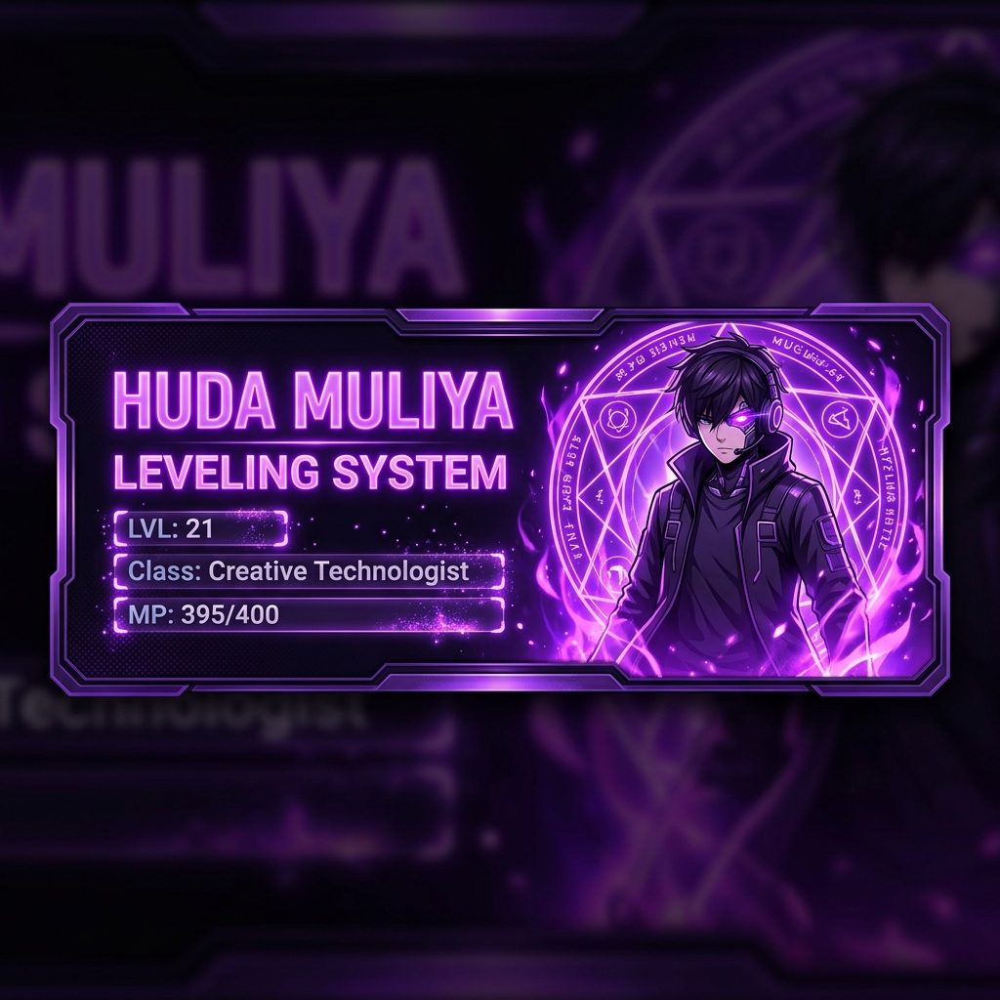

  

# 👤 HUNTER STATUS WINDOW

  
  
  
  
  

---

## 💫 Deskripsi Hunter (About Me)

Saya adalah mahasiswa **S1 Informatika di UNU Yogyakarta** (IPK **3.95/4.00**) yang secara unik memadukan kekuatan analitis di bidang **Pengembangan Web & UI/UX Design** dengan kemampuan komunikasi tingkat tinggi sebagai **Public Speaker (MC)** dan **Digital Content Creator**. Selaku **Ketua Himpunan Mahasiswa Informatika (HIMATIKA)**, saya berpengalaman memimpin tim untuk menyelesaikan berbagai misi digital yang kompleks.

---

## 📊 Hunter Stats (Skill Points)

| 💻 Tech & Development Stats | 🎙️ Creative & Communication Stats |
| :--- | :--- |
| **STR (Frontend Engineering):** 85%  `[██████████████████████████░░░░░]`  React.js, Next.js, Tailwind CSS, Bootstrap | **CHA (Public Speaking):** 95%  `[██████████████████████████████░░]`  Master of Ceremony (Formal, Seminar, Wisuda) |
| **INT (Backend & API Systems):** 75%  `[██████████████████████░░░░░░░░░░]`  Python, PHP, FastAPI, RESTful API | **AGI (Branding & Identity):** 85%  `[██████████████████████████░░░░░]`  Campus Talent & Brand Ambassador |
| **SEN (UI/UX & Wireframing):** 80%  `[████████████████████████░░░░░░░░]`  User-Centered Design, Wireframing, Figma | **LUK (Digital Content):** 80%  `[████████████████████████░░░░░░░░]`  Content Strategy, Media Production, Campaign Planning |
| **VIT (Architecture & Systems):** 75%  `[██████████████████████░░░░░░░░░░]`  MVC Pattern, Responsive Web Design | **LEAD (Leadership):** 90%  `[████████████████████████████░░░░]`  Strategic Coordination & Public Relation |

---

## ⚔️ Misi yang Diselesaikan (Completed Quests / Projects)

*   **⚡ HairCheck – Decision Support System** *(UI/UX & Frontend Developer)*
    *   *Objective:* Sistem pendukung keputusan (SPK) berbasis web dengan metode SAW untuk rekomendasi perawatan rambut.
    *   *Loot:* `React.js` • `FastAPI` • `SAW Method`
    *   *Portal:* [Figma Design](https://www.figma.com/design/WfZhETDEkIDRuc1oq4RSdK/HAIRCHECK?node-id=0-1) | [Live Demo](https://front-end-hair-check.vercel.app/)
*   **✈️ NusaGo – Digital Travel Platform** *(Frontend Developer Intern)*
    *   *Objective:* Pengembangan dan pemeliharaan antarmuka web platform pemesanan tiket dan layanan perjalanan yang responsif dan interaktif.
    *   *Loot:* `React.js` • `Vite` • `Tailwind CSS`
    *   *Portal:* [Live Demo](https://nusago.id/)
*   **🛍️ Bekasin – Second-Hand Marketplace** *(Frontend Developer)*
    *   *Objective:* Platform e-commerce/marketplace digital berbasis web yang dirancang khusus untuk memfasilitasi transaksi jual-beli barang bekas (thrifting).
    *   *Loot:* `React.js` • `Tailwind CSS` • `Vite`
    *   *Portal:* [Live Demo](https://bekasin-marketplace.vercel.app/)
*   **🍎 AppleScan – Classification System** *(Frontend Developer)*
    *   *Objective:* Antarmuka web interaktif untuk sistem klasifikasi kualitas buah apel berbasis Machine Learning KNN.
    *   *Loot:* `Python` • `KNN` • `Responsive Layout`
    *   *Portal:* [Live Demo](https://apple-scan.vercel.app/)
*   **🏫 School Website Redesign** *(Freelance Frontend Developer)*
    *   *Objective:* Desain dan pengembangan landing page interaktif terintegrasi untuk digitalisasi profil sekolah PP Roudlotush Sholihin.
    *   *Loot:* `React.js` • `Tailwind CSS`
    *   *Portal:* [Website Sekolah](https://roudlotushsholihin.ponpes.id/)

---

## 💼 Catatan Ekspedisi (Experience & Raid History)

### 💻 Raid Bidang Teknologi (Tech Experience)
*   **🏢 PT NusaGo Digital Travelindo Guild** — *Frontend Developer Intern*
    *   *April 2026 - Sekarang*
    *   Mengembangkan antarmuka aplikasi web travel, mengimplementasikan desain responsif, dan berkolaborasi dalam tim produk digital.
*   **🛠️ Independent Party (Freelance Web Developer)** — *Self-Employed*
    *   *Des 2025 - Sekarang*
    *   Membangun antarmuka web kustom yang interaktif menggunakan React.js untuk berbagai klien.

### 🎙️ Raid Bidang Kreatif (Creative Experience)
*   **🎤 Master of Ceremony & Host** — *Freelance & Campus Events*
    *   *Sep 2024 - Sekarang*
    *   Memandu puluhan acara akademik dan non-akademik universitas (audiens 1000+), termasuk Wisuda UNU Yogyakarta 2025.
*   **📸 Freelance Model & Content Creator** — *Collaboration*
    *   *Juli 2023 - Sekarang*
    *   Kolaborasi digital membuat konten kreatif bersama brand terkemuka (**Rexona, Pocari Sweat, Skin1004, Isntree, Realfood**).

### 👑 Guild Master (Leadership)
*   **🦁 HMP Informatika UNU Yogyakarta (HIMATIKA)** — *Ketua Himpunan*
    *   *Juni 2025 - Sekarang*
    *   Memimpin koordinasi strategis organisasi, menyusun program kerja tahunan, dan mengelola komunikasi eksternal.

---

## 🎓 Tempat Pelatihan (Education)

*   **UNU Yogyakarta Academy** (S1 Informatika) ─── `LVL UP`
    *   *2023 - Sekarang* | **IPK: 3.95 / 4.00**
*   **SMK TKMT Kebumen Academy** (Multimedia) ─── `GRADUATED`
    *   *2020 - 2023* | **Nilai: 89.90 / 100**

---

## 📊 Statistik Hunter (GitHub Stats)

  
  

---

  <i>"Combining logic with communication, building interfaces and connections."</i> 
  <b>Huda Muliya</b> • Godean, DIY, Indonesia

