# Hi there! I'm Huda Muliya 👋
### Creative Technologist | Web Developer | Public Communicator | Digital Content Creator

  

  
  
  
  
  
  

---

## 💫 Ringkasan Profesional (Professional Summary)

Mahasiswa Program Studi **Informatika Universitas Nahdlatul Ulama Yogyakarta** yang memiliki ketertarikan mendalam pada pengembangan web, desain antarmuka digital, dan komunikasi publik. Berpengalaman dalam mengerjakan beberapa proyek aplikasi berbasis web menggunakan PHP dan React.js, serta aktif dalam kegiatan organisasi, *public speaking*, dan pembuatan konten digital. Selain itu, juga memiliki jam terbang tinggi sebagai Master of Ceremony dalam berbagai acara akademik dan organisasi tingkat universitas. Dikenal sebagai pribadi yang adaptif, komunikatif, disiplin, dan mampu berkolaborasi dengan baik dalam lingkungan kerja teknis maupun kreatif.

---

## 🎮 Game Interaktif: Huda's Tech & Creative Quest
Pilihlah salah satu peran di bawah ini untuk memulai petualangan interaktif menjelajahi portofolio Huda! Klik pada opsi untuk membuka cerita berikutnya.

  
<b>💻 Jalur Developer (Web & UI/UX)</b>

  <blockquote style="background-color: #0d1117; border-left: 4px solid #22d3ee; padding: 10px; margin-top: 10px;">
    Kamu baru saja bergabung sebagai Frontend Developer Intern di <b>PT NusaGo Digital Travelindo</b>. Tugas pertamamu adalah mengimplementasikan desain Figma baru yang interaktif dan responsif pada berbagai perangkat. Apa strategi pertamamu?
  </blockquote>
  
  

    
<i>Pilihan A: Menggunakan CSS Flexbox/Grid dengan Tailwind CSS untuk fleksibilitas tinggi.</i>

    <blockquote style="background-color: #0d1117; border-left: 4px solid #28a745; padding: 10px; margin-top: 10px;">
      <b>Berhasil!</b> Layout website ter-render dengan sempurna, responsif di mobile, dan lolos uji linter. Tim sangat terkesan! 
        
      Kini kamu dialihkan ke proyek riset mandiri: <b>HairCheck System</b> (Sistem Pendukung Keputusan kesehatan kulit kepala). Kamu harus memilih algoritma penentuan rekomendasi perawatan terbaik. Apa pilihanmu?
    </blockquote>
    
    

      
<b>Opsi A1: Menggunakan Metode SAW (Simple Additive Weighting) untuk pembobotan kriteria.</b>

      <blockquote style="background-color: #0d1117; border-left: 4px solid #28a745; padding: 10px; margin-top: 10px;">
        🎉 <b>Luar Biasa!</b> Sistem pendukung keputusan berjalan mulus, memberikan rekomendasi yang presisi berdasarkan kondisi kulit kepala pengguna. Kamu berhasil meluncurkan aplikasi ini dan dihadiahi <b>Lencana Master Developer 🏆</b>!
          
        👉 Lihat proyek nyata ini di: <a href="https://front-end-hair-check.vercel.app/" target="_blank">Live HairCheck Demo</a> | <a href="https://www.figma.com/design/WfZhETDEkIDRuc1oq4RSdK/HAIRCHECK?node-id=0-1" target="_blank">Figma Design</a>
      </blockquote>
    

    
    

      
<b>Opsi A2: Menggunakan Algoritma K-Nearest Neighbor (KNN).</b>

      <blockquote style="background-color: #0d1117; border-left: 4px solid #dc3545; padding: 10px; margin-top: 10px;">
        ❌ Kurang tepat untuk SPK pembobotan kriteria rambut. Namun, KNN adalah algoritma yang tepat untuk klasifikasi citra buah pada proyek <b>AppleScan</b>!
          
        👉 Coba kembali pilihan di atas dan pilih metode <b>SAW</b> untuk menyelesaikan HairCheck Quest! Atau kamu bisa melihat proyek klasifikasi apel di sini: <a href="https://apple-scan.vercel.app/" target="_blank">Live AppleScan Demo</a>
      </blockquote>
    

  

  
  

    
<i>Pilihan B: Menulis ribuan baris CSS manual murni inline di setiap komponen.</i>

    <blockquote style="background-color: #0d1117; border-left: 4px solid #dc3545; padding: 10px; margin-top: 10px;">
      <b>Oh tidak!</b> Codebase menjadi berantakan, sulit dipelihara, dan memicu error pada proses building. Lead Engineer menyuruhmu me-refactor kode. 
        
      👉 Putar balik dan pilih <b>Pilihan A (Tailwind CSS)</b> untuk menyelamatkan proyek!
    </blockquote>
  

  
<b>🎙️ Jalur Public Communicator (Master of Ceremony)</b>

  <blockquote style="background-color: #0d1117; border-left: 4px solid #f97316; padding: 10px; margin-top: 10px;">
    Kamu memegang mikrofon di atas panggung megah <b>Wisuda 2025 UNU Yogyakarta</b>. Di depanmu duduk Rektor, Senat, dan lebih dari 1000 wisudawan beserta orang tua mereka. Ruangan menjadi hening menanti suaramu membuka prosesi pemanggilan wisudawan. Bagaimana kamu membuka acara?
  </blockquote>
  
  

    
<i>Pilihan A: Mulai dengan suara diafragma mantap, artikulasi jelas, membawakan salam formal yang khidmat namun hangat.</i>

    <blockquote style="background-color: #0d1117; border-left: 4px solid #28a745; padding: 10px; margin-top: 10px;">
      <b>Luar biasa!</b> Suaramu menggema dengan penuh wibawa. Seluruh hadirin mendengarkan dengan seksama, dan prosesi pembukaan berjalan khidmat dan tertib. 
        
      Acara berlanjut ke sesi non-formal: <b>Euforia & Selebrasi Wisudawan</b>. Suasana panggung perlu dicairkan agar lebih ceria dan interaktif tanpa kehilangan ketertiban. Apa tindakanmu?
    </blockquote>
    
    

      
<b>Opsi A1: Mengajak audiens bertepuk tangan berirama, membawakan pantun selebrasi, dan berinteraksi langsung dengan beberapa wisudawan.</b>

      <blockquote style="background-color: #0d1117; border-left: 4px solid #28a745; padding: 10px; margin-top: 10px;">
        🎉 <b>Sukses Besar!</b> Seluruh wisudawan bersorak gembira, atmosfer dipenuhi kebahagiaan, dan Rektor memberikan apresiasi atas pembawaan MC-mu yang dinamis. Kamu dianugerahi <b>Bintang Emas Public Speaker ⭐</b>!
          
        👉 Prestasi ini nyata terjadi pada event: <i>Wisuda UNU Jogja 2025</i> & <i>OSPEK Genius 2024</i>!
      </blockquote>
    

    
    

      
<b>Opsi A2: Mempertahankan intonasi kaku dan pembawaan super formal tanpa interaksi.</b>

      <blockquote style="background-color: #0d1117; border-left: 4px solid #dc3545; padding: 10px; margin-top: 10px;">
        ❌ Suasana panggung selebrasi menjadi canggung dan membosankan. Beberapa audiens mulai bermain handphone karena bosan. 
          
        👉 Putar balik dan pilih <b>Opsi A1</b> untuk mencairkan suasana dengan energi komunikatif Huda!
      </blockquote>
    

  

  
  

    
<i>Pilihan B: Berbicara terlalu cepat karena gugup, membuat beberapa nama wisudawan salah sebut.</i>

    <blockquote style="background-color: #0d1117; border-left: 4px solid #dc3545; padding: 10px; margin-top: 10px;">
      <b>Aduh!</b> Konsentrasi pecah dan sempat terjadi keheningan canggung di panggung. Panitia memberi kode dari balik panggung untuk tenang dan mengatur napas.
        
      👉 Tenang, tarik napas dalam-dalam, lalu pilih <b>Pilihan A</b> untuk memimpin panggung dengan penuh percaya diri!
    </blockquote>
  

  
<b>📸 Jalur Creative & Digital Content Creator</b>

  <blockquote style="background-color: #0d1117; border-left: 4px solid #a855f7; padding: 10px; margin-top: 10px;">
    Sebuah brand multinasional (seperti <b>Pocari Sweat</b> atau <b>Rexona</b>) menawarkan kolaborasi iklan kreatif berbayar di akun Instagram-mu. Mereka memintamu merancang konsep konten visual lifestyle. Konsep mana yang kamu ajukan?
  </blockquote>
  
  

    
<i>Pilihan A: Merancang reels video transisi estetik, memperlihatkan kesegaran produk saat kamu beraktivitas aktif/kuliah, dengan visual posing profesional.</i>

    <blockquote style="background-color: #0d1117; border-left: 4px solid #28a745; padding: 10px; margin-top: 10px;">
      <b>Brilian!</b> Draf konten disetujui langsung oleh Brand Manager tanpa revisi. Konten yang kamu unggah mendapat engagement tinggi dari audiens.
        
      Berkat performa impresifmu, kamu ditunjuk oleh kampus UNU Yogyakarta untuk mewakili mahasiswa sebagai <b>Among Tamu VIP</b> dalam menyambut tokoh nasional (seperti Pak Luhut & Pak Pratik). Bagaimana kamu mempersiapkan penampilan visualmu?
    </blockquote>
    
    

      
<b>Opsi A1: Mengenakan pakaian adat/batik formal rapi, menjaga postur tegak yang sopan, ramah, dan memancarkan aura hospitality profesional.</b>

      <blockquote style="background-color: #0d1117; border-left: 4px solid #28a745; padding: 10px; margin-top: 10px;">
        👑 <b>Sempurna!</b> Sesi penyambutan berjalan sukses, tamu penting merasa disambut hangat, dan kamu mendapat apresiasi langsung dari Humas Universitas. Kamu membuka <b>Mahkota Kreatif Terbaik 👑</b>!
          
        👉 Ini adalah representasi nyata kolaborasi Huda bersama brand **Rexona, Pocari Sweat, Skin1004** serta tugas Among Tamu VIP di UNU Jogja!
      </blockquote>
    

    
    

      
<b>Opsi A2: Datang terlambat dan mengenakan pakaian kasual santai.</b>

      <blockquote style="background-color: #0d1117; border-left: 4px solid #dc3545; padding: 10px; margin-top: 10px;">
        ❌ Ini melanggar protokol universitas dan merusak citra profesional Among Tamu. 
          
        👉 Putar balik dan persiapkan dirimu dengan matang pada <b>Opsi A1</b> untuk memberikan impresi terbaik!
      </blockquote>
    

  

  
  

    
<i>Pilihan B: Mengunggah draf foto produk seadanya yang blur dengan caption satu kata tanpa cerita.</i>

    <blockquote style="background-color: #0d1117; border-left: 4px solid #dc3545; padding: 10px; margin-top: 10px;">
      <b>Ditolak!</b> Tim marketing brand menolak draf tersebut karena tidak kreatif dan tidak sesuai dengan brief branding visual. 
        
      👉 Ingat keahlian multimediamu di SMK! Putar balik dan pilih <b>Pilihan A</b> untuk membuat karya yang estetik.
    </blockquote>
  

---

## 🛠️ Kompetensi Utama (Core Competencies)

| 💻 Kompetensi Teknis & Digital | 🎙️ Kompetensi Kreatif & Komunikasi |
| :--- | :--- |
| • Web Application Development | • Digital Content & Media Production |
| • Frontend Development (React.js, Next.js) | • Public Speaking & Event Hosting (MC) |
| • UI/UX Design & Wireframing | • Creative Communication |
| • Responsive Web Design (Tailwind, Bootstrap) | • Social Media Management |
| • MVC Architecture Implementation (PHP) | • Branding & Visual Communication |
| • Digital Product Development | • Team Collaboration & Leadership |

---

## 💻 Tech & Development Stack

### 🛠️ Bahasa & Teknologi

  
  
  
  
  

### 📦 Framework & Tools

  
  
  
  
  
  
  

---

## 🚀 Proyek Pilihan (Selected Projects)

### 🌐 Web & Digital Products
* **HairCheck – Decision Support System** *(UI/UX & Frontend Developer — 2026)*
  * Merancang UI/UX end-to-end mulai dari wireframe hingga sistem visual.
  * Mengembangkan landing page interaktif dengan pendekatan modern dan responsif.
  * Mengintegrasikan konsep Sistem Pendukung Keputusan ke dalam pengalaman pengguna yang intuitif.
  * **Link:** [Figma Design](https://www.figma.com/design/WfZhETDEkIDRuc1oq4RSdK/HAIRCHECK?node-id=0-1&p=f&t=ZBwYZjyjgvgkoAeN-0) | [Live Demo](https://front-end-hair-check.vercel.app/)
* **AppleScan – Classification System** *(Frontend Developer — 2026)*
  * Mengembangkan antarmuka visual untuk sistem klasifikasi berbasis machine learning.
  * Mendesain tampilan interaktif dengan pendekatan modern dan dinamis.
  * Mengoptimalkan pengalaman pengguna melalui animasi dan layout responsive.
  * **Link:** [Live Demo](https://apple-scan.vercel.app/)
* **School Website Redesign** *(Frontend Developer — Freelance — 2025)*
  * Mendesain dan mengembangkan landing page interaktif untuk meningkatkan citra digital sekolah.
  * Menerapkan arsitektur komponen untuk memudahkan pengelolaan dan pengembangan lanjutan.
  * Berkolaborasi langsung dengan klien untuk menerjemahkan kebutuhan bisnis ke dalam desain responsif.
  * **Link:** [Web PP Roudlotush Sholihin](https://roudlotushsholihin.ponpes.id/)
* **Web-Based Point of Sale System (Kasir Unupreneurs)** *(Academic Project — 2024)*
  * Mengembangkan sistem kasir berbasis web untuk manajemen transaksi dan laporan penjualan.
  * Membangun fitur manajemen stok, pesanan, dan kontrol akses admin.
  * Mendesain antarmuka responsif dan terstruktur untuk meningkatkan efisiensi operasional.
  * **Link:** [GitHub Repo](https://github.com/HudaMuliya/uas-prak-web)
* **KoMpak – Organization Management System** *(Academic Project — 2024)*
  * Mengembangkan sistem manajemen organisasi kampus berbasis web dengan pendekatan terstruktur (MVC PHP).
  * Membangun fitur booking ruangan, manajemen anggota, serta laporan kegiatan.
  * Mendesain antarmuka modern dan user-friendly.
  * **Link:** [GitHub Repo](https://github.com/HudaMuliya/OOP_KOMPAK)

---

## 💼 Pengalaman Profesional & Kreatif (Experience)

### 💻 Bidang Teknologi
* **PT NusaGo Digital Travelindo** — *Frontend Developer Intern* (April 2026 - Sekarang)
  * Mengembangkan antarmuka website dan aplikasi menggunakan teknologi frontend modern.
  * Mengimplementasikan desain UI/UX menjadi tampilan responsif dan interaktif.
  * Berkolaborasi dengan tim desain dan pengembang dalam pengembangan produk digital.

### 🎙️ Bidang Komunikasi & Kreatif
* **Master of Ceremony & Host Event** — *Freelance & Campus Events* (Sep 2024 - Sekarang)
  * Berpengalaman memandu puluhan acara formal dan non-formal universitas dengan total audiens mencapai 1000+. Acara yang pernah dipandu meliputi:
    * *MC Malam Tahun Baru 2026 (2026)*
    * *Seminar Hari Guru (2025)*
    * *MC Memanggil Wisudawan & Selebrasi Wisuda (2024)*
    * *OSPEK "GENIUS" Mahasiswa Baru (2024)*
    * *Rektor Menyapa (2024)*
    * *Workshop Building Mini Chatbot (2024)*
    * *Stadium General & Kuliah Umum FTI (2024)*
    * *User Education (2024)*
    * *Makrab Informatika (2024)*
    * *Studi Banding HIMA UTY x UNU Yogyakarta (2024)*
    * *Horizon of Creative (2024)*
    * *Pelantikan HIMATIKA Masa Bhakti 2024/2025 (2024)*
    * *Informatics Studio 1.0 (2023)*
* **Freelance Model** — *Man Model* (Juli 2023 - Sekarang)
  * Bekerja sama dengan fotografer dan brand untuk konten visual promosi serta berpartisipasi dalam sesi foto, video, dan fashion show.
* **Partipost** — *Freelance Influencer* (Des 2022 - Nov 2023)
  * Bekerja dengan berbagai brand untuk mempromosikan produk/layanan dalam media sosial dan membuat konten kreatif sesuai arahan dari klien (Rexona, Pocari Sweat, Skin1004, Isntree, Herbavomitz, Realfood).
* **TMSS Management** — *Social Media Administrator* (Juni 2020 - Mei 2023)
  * Membuat konten media sosial seperti feed, story, dan reels serta menjadi narahubung antara brand dengan influencer.

### 🍽️ Pengalaman Kerja Lainnya
* **Halagrill Kitchen & Bar** — *Waiter & Barista* (Mei 2023 - Sep 2023)
  * Menyajikan minuman spesial, mengoperasikan mesin kopi, menjaga kebersihan, kenyamanan area layanan, serta membangun komunikasi yang baik dengan pelanggan.

---

## 👥 Pengalaman Organisasi & Volunteer (Leadership & Volunteer)

### 🏢 Organisasi
* **HMP INFORMATIKA UNU YOGYAKARTA (HIMATIKA)**
  * **Ketua Himpunan** (Juni 2025 - Sekarang)
    * Memimpin dan mengkoordinasikan seluruh kegiatan organisasi secara strategis.
    * Menyusun program kerja tahunan bersama seluruh divisi untuk mendukung pengembangan mahasiswa Informatika.
    * Mewakili mahasiswa dalam forum resmi tingkat fakultas dan universitas serta membangun hubungan eksternal dengan mitra strategis.
  * **Koordinator Humas** (Juli 2024 - Juni 2025)
    * Mengelola seluruh aktivitas komunikasi eksternal, promosi organisasi, dan kemitraan/sponsorship.
    * Menyusun strategi publikasi dan mengoordinasikan tim humas dalam produksi konten kreatif di media sosial.
* **OSIS SMPN 7 KEBUMEN** — *Wakil Ketua II* (2018 - 2019)
    * Mendampingi ketua dalam perencanaan dan pelaksanaan program kerja organisasi siswa.
    * Menginisiasi dan membantu pelaksanaan kegiatan sekolah seperti lomba, pelatihan, dan peringatan hari besar.
    * Menjadi penghubung antara siswa, guru, dan pembina OSIS dalam menyampaikan aspirasi serta evaluasi kegiatan.
    * Memimpin rapat OSIS saat ketua berhalangan dan memastikan pengambilan keputusan berjalan efektif.

### 🤝 Kegiatan Relawan (Volunteer)
* **UNU Jogja Career Days** (Liaison Officer — 2025)
* **Informatalk** (2025)
* **Hospitality – PyCon APAC** (2024)
* **OSPEK GENIUS 2024** (Panitia Divisi Acara & MC — 2024)
* **MAKRAB Informatika** (Panitia — 2024)
* **Informatic Studio 1.0** (Panitia — 2024)
* **Horizon Of Creativa** (Panitia — 2024)
* **Diseminasi MSIB** (Relawan — 2024)

---

## 🎓 Pendidikan & Detail Pribadi (Education & Personal Info)

### 🏫 Pendidikan
* **UNU Yogyakarta** — S1 Informatika, Fakultas Teknologi Informasi (2023 - Sekarang)
  * **IPK:** 3.95 / 4.00
  * **Fokus Pembelajaran:** Pengembangan Web, Rekayasa Perangkat Lunak, Desain UI/UX, Analisis & Perancangan Sistem.
* **SMK TKMT Kebumen** — Multimedia (Juli 2020 - Mei 2023)
  * **Nilai:** 89.90 / 100
  * **Fokus Pembelajaran:** Graphic Design, Multimedia Production, Digital Content Creation, Visual Communication.

### ℹ️ Informasi Tambahan
* **Detail Fisik (Model):** Tinggi Badan: 169 cm | Berat Badan: 50 kg
* **Bahasa:** Indonesia (Native), Inggris (Basic Komunikasi)

---

## 📊 Statistik GitHub (GitHub Stats)

  
  

---

  <i>"Combining logic with communication, building interfaces and connections."</i> 
  <b>Huda Muliya</b> • Sleman, DIY, Indonesia

