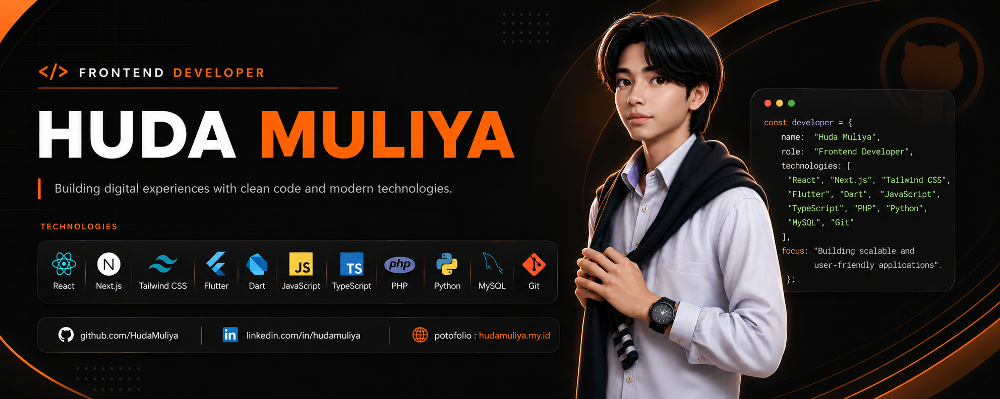

  
  
    
  
  
  
  

    
  
  

 

### 🚀 Tech Stack & Tools

  

 

### 💡 Featured Projects

<table border="0" width="100%" align="center">
  <tr>
    <td width="50%" valign="top">
      <h4>🏨 TheKost</h4>
      
Property rental platform frontend.

      
      
      
    </td>
    <td width="50%" valign="top">
      <h4>🏢 PT NusaGo Company Profile</h4>
      
Official responsive company website.

      
      
      
    </td>
  </tr>
  <tr>
    <td width="50%" valign="top">
      <h4>📚 NusaGo Partner Docs</h4>
      
Internal documentation platform frontend.

      
      
      
    </td>
    <td width="50%" valign="top">
      <h4>📱 NusaGo Mobile App</h4>
      
Mobile application UI screens.

      
      
    </td>
  </tr>
  <tr>
    <td width="50%" valign="top">
      <h4>🍎 AppleScan ML Interface</h4>
      
UI for ML-based fruit classification.

      
      
    </td>
    <td width="50%" valign="top">
      <h4>💇 HairCheck System</h4>
      
UI/UX design & frontend development.

      
      
    </td>
  </tr>
</table>

 

### 📊 GitHub Metrics

  
  
  
    
  
  <picture>
    <source media="(prefers-color-scheme: dark)" srcset="https://raw.githubusercontent.com/HudaMuliya/HudaMuliya/output/github-contribution-grid-snake-dark.svg">
    <source media="(prefers-color-scheme: light)" srcset="https://raw.githubusercontent.com/HudaMuliya/HudaMuliya/output/github-contribution-grid-snake.svg">
    
  </picture>

