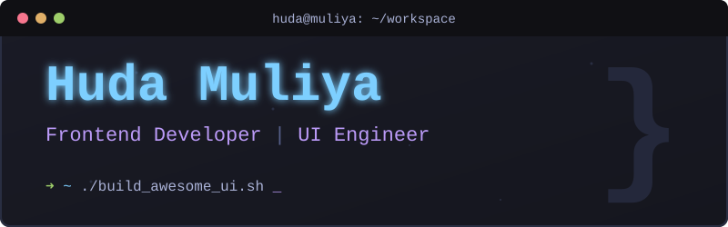

<div align="center">



<br/>


<br/>

<a href="https://portofolio-huda-muliya.vercel.app" target="_blank">
  
</a>
<a href="https://www.linkedin.com/in/hudamuliya" target="_blank">
  
</a>
<a href="https://github.com/HudaMuliya" target="_blank">
  
</a>
<a href="mailto:hudamuliya@gmail.com" target="_blank">
  
</a>
<a href="https://wa.me/62895423216883" target="_blank">
  
</a>

<br/><br/>


</div>

---

### ⚡ neofetch --about

```javascript
const huda_muliya = {
  title: "Frontend Developer & UI Engineer",
  location: "Yogyakarta, Indonesia",
  education: {
    university: "Universitas Nahdlatul Ulama Yogyakarta",
    major: "Informatics",
    gpa: 3.95
  },
  experience: {
    current: "Frontend Developer Intern @ PT NusaGo Digital Travelindo",
    past: ["Freelance Frontend Developer", "UI/UX Designer"]
  },
  leadership: [
    "Head of Informatics Student Association (HMP Informatika)",
    "Public Relations Coordinator"
  ],
  passions: ["Building clean interfaces", "Agile collaboration", "Public Speaking (MC)"]
};
```

---

### 💻 cat ~/skills.txt

<div align="center">
  


<br/><br/>


</div>

---

### 📁 ls -la ~/projects

<div align="center">

<table>
<tr>
<td width="50%" valign="top">

**[ ✈️ NusaGo – Travel Platform ]**
> Internship · Frontend Developer
<br/>

[](#)
[](#)


</td>
<td width="50%" valign="top">

**[ 📚 NusaGo Partner Docs ]**
> Documentation Platform
<br/>

[](#)
[](#)


</td>
</tr>
<tr>
<td width="50%" valign="top">

**[ 📱 NusaGo Mobile App ]**
> Mobile Frontend Developer
<br/>

[](#)
[](#)


</td>
<td width="50%" valign="top">

**[ 🍎 AppleScan – ML Classifier ]**
> Frontend Developer
<br/>

[](#)
[](#)


</td>
</tr>
<tr>
<td width="50%" valign="top">

**[ ⚡ HairCheck – DSS System ]**
> UI/UX & Frontend Developer
<br/>

[](#)
[](#)


</td>
<td width="50%" valign="top">

**[ 🏫 MTs Roudlotush Sholihin ]**
> Freelance Frontend Developer
<br/>

[](#)
[](#)


</td>
</tr>
<tr>
<td width="50%" valign="top">

**[ 🛒 Kasir Unupreneurs ]**
> Full-Stack POS System
<br/>

[](#)
[](#)


</td>
<td width="50%" valign="top">

**[ 🏛️ KoMpak ]**
> Campus Org Management System
<br/>

[](#)
[](#)


</td>
</tr>
</table>

</div>

---

### 📊 htop --user github_stats

<div align="center">


&nbsp;


<br/><br/>


<br/>


</div>

---

<div align="center">


</div>